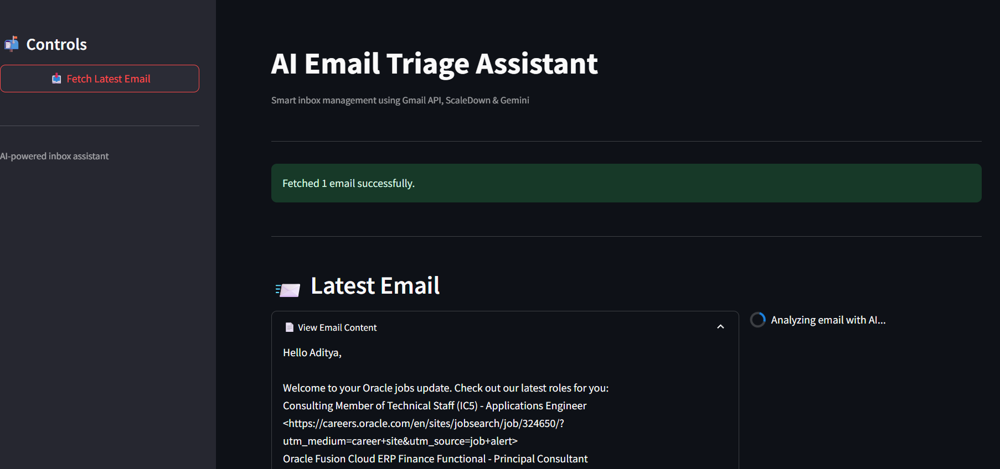
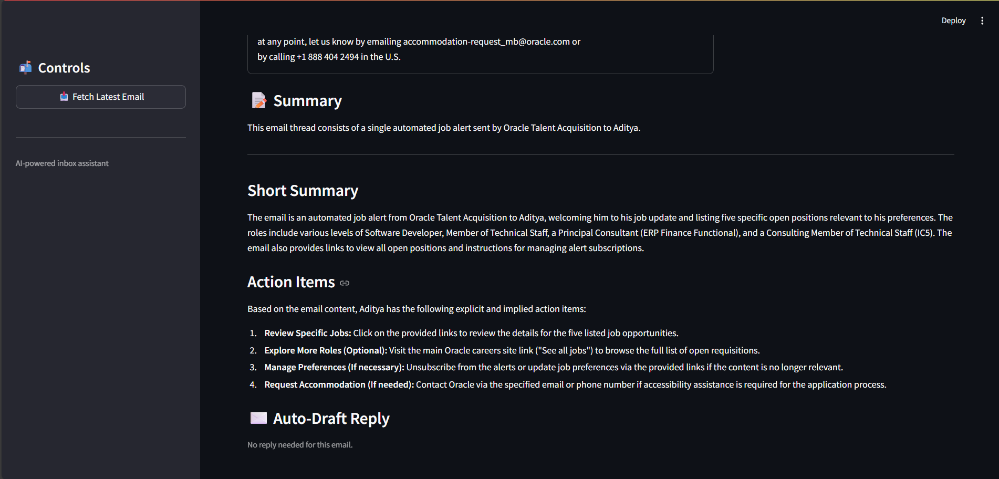
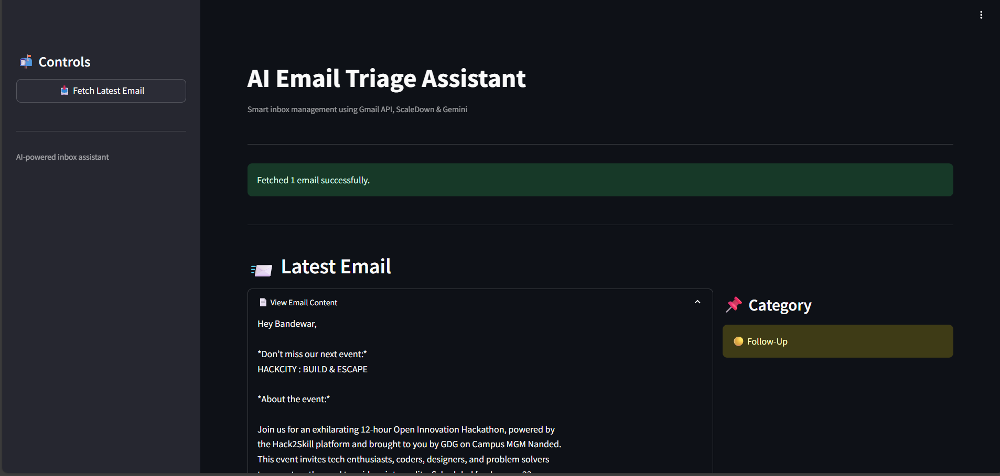
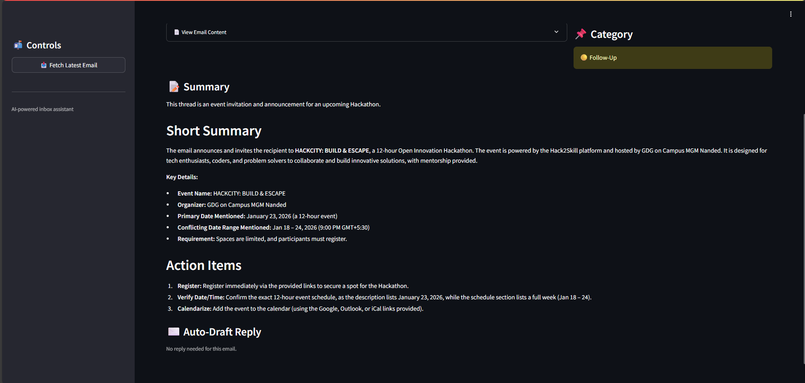
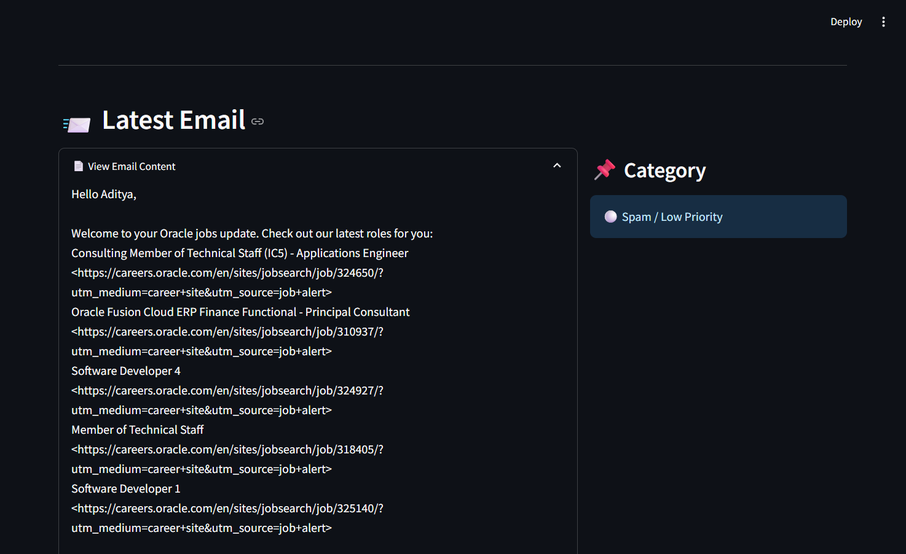

# AI Email Triage Assistant

AI system that fetches emails from Gmail, compresses long threads using ScaleDown,
and applies RAG with Gemini LLM to summarize, categorize, and generate replies.

## Tech Stack
- Gmail API
- ScaleDown API (compression)
- Gemini LLM
- FAISS (RAG)
- Streamlit

## Features
- Email categorization (Urgent / Follow-Up / Spam)
- Long thread summarization
- Context-aware reply drafting
- Token cost optimization via compression

## Run
1. Add keys in `.env`
2. Add Gmail `credentials.json`
3. `pip install -r requirements.txt`
4. `streamlit run app.py`

## Documenation 
https://docs.google.com/document/d/1CvLaKB3tZ5lJeNs1PABSAvAviK_PAI0m/edit?usp=drive_link&ouid=113157617250399139462&rtpof=true&sd=true

## Sample images
    